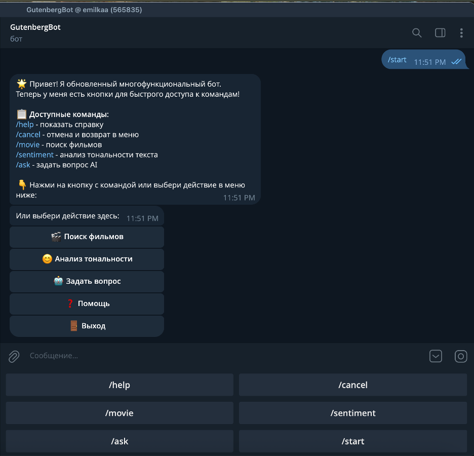

<div align="center">
  <h1>Телеграм бот</h1>
  <p><i>Поиск фильмов · Анализ тональности · Общение с AI</i></p>
</div>

---

## Скриншот главного меню

<div align="center">
  
  <p><i>Пример отображения основного меню и команд бота</i></p>
</div>

---

## Используемые API

### 1. ** Поиск кино API (unofficial)**
   - **Описание:** Неофициальное API популярного сервиса о кино. Позволяет искать фильмы, получать информацию о рейтингах, описании, годе выпуска и другие данные.
   - **Эндпоинт:** `https://api.poiskkino.dev/v1.4/movie/search`
   - **Задача в боте:** Обработка команды `/movie`. Поиск фильмов по названию и вывод краткой информации (название, год, рейтинг, описание).

### 2. **Gen‑API (GLM‑5)**
   - **Описание:** Сервис для доступа к большим языковым моделям, включая GLM‑5. Предоставляет возможность задавать вопросы и получать сгенерированные ответы.
   - **Эндпоинт:** `https://api.gen-api.ru/api/v1/networks/glm-5`
   - **Задача в боте:** Обработка команды `/ask`. Отправка пользовательского вопроса к модели и возврат сгенерированного ответа.

---

## Модели искусственного интеллекта

### Базовая модель (для `/ask`): **GLM‑5**
   - **Разработчик:** Zhipu AI
   - **Тип:** Большая языковая модель (LLM)
   - **Задача:** Генерация ответов на вопросы пользователей в свободной форме. Используется через Gen‑API.

### Модель трансформера (для `/sentiment`): **GLiClass (Instruct Large v1.0)**
   - **Название на Hugging Face:** `knowledgator/gliclass-instruct-large-v1.0`
   - **Тип:** Модель для zero-shot классификации текста.
   - **Задача:** **Классификация тональности (sentiment analysis).** Модель определяет эмоциональную окраску текста, относя его к одной из трёх категорий:
     - `positive` (😊 положительная)
     - `negative` (😞 отрицательная)
     - `neutral` (😐 нейтральная)
   - **Особенность:** Модель работает в режиме zero-shot, что означает, что она может классифицировать текст по заданным пользователем меткам без дополнительного обучения.

---

## 📂 Система контроля версий

Проект разрабатывался с использованием системы контроля версий **Git** и размещён в удалённом репозитории на **GitHub**.

<div align="center">
  <a href="https://github.com/Emilrazl/SecondSemestr.git">
    
  </a>
</div>

### Основные этапы разработки:
- Инициализация репозитория (`git init`).
- Добавление файлов проекта (`git add .`).
- Фиксация изменений с осмысленными комментариями (`git commit -m "..."`).
- Подключение удалённого репозитория (`git remote add origin ...`).
- Отправка кода на GitHub (`git push -u origin main`).

---

## 🛠️ Технологический стек

- **Язык:** Python 3.9+
- **Основные библиотеки:**
  - `python-telegram-bot` — взаимодействие с Telegram Bot API.
  - `transformers` & `gliclass` — загрузка и использование модели GLiClass.
  - `requests` — обращение к внешним API.
  - `python-dotenv` — управление переменными окружения.
- **Формат диалогов:** ConversationHandler (машина состояний).

---

## Как запустить проект локально

1. **Клонируйте репозиторий:**
   ```bash
   git clone https://github.com/Emilrazl/telegram-bot.git
   cd YOUR_REPOSITORY